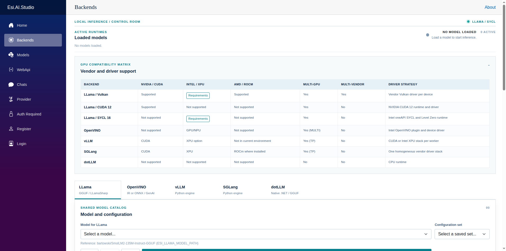
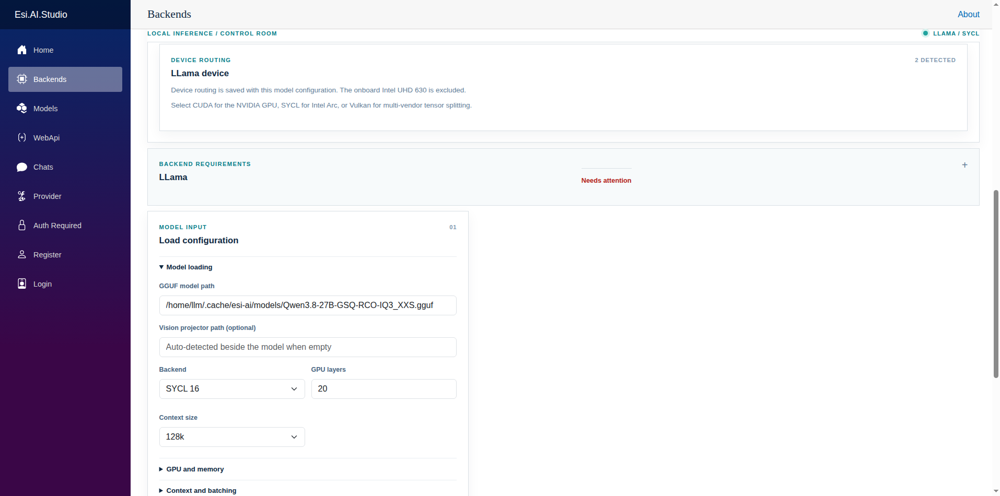

# Esi.AI

Esi.AI is licensed under the Apache License, Version 2.0. See [LICENSE](LICENSE).
Third-party components retain their original licenses; see [THIRD-PARTY-NOTICES.md](THIRD-PARTY-NOTICES.md).

Esi.AI is a C# fork designed for seamless integration with VS Code and GitHub Copilot. It provides a robust framework for extending AI capabilities within the development environment.

## Project Overview

Esi.AI serves as a central hub for several key components and forks, enabling advanced AI-driven workflows:

- **DebugMCP** and **Terminal MCP**: VS Code MCP tooling in [`src/vscode/vscode-esi-mcp`](src/vscode/vscode-esi-mcp).
- **Esi.AI Studio**: .NET backend and VS Code provider in [`src/Esi.AI`](src/Esi.AI) and [`src/vscode/vscode-esi-ai-studio`](src/vscode/vscode-esi-ai-studio).
- **LiteLLM**: Embedded LiteLLM source in [`origins/litellm`](origins/litellm), based on [BerriAI/litellm](https://github.com/BerriAI/litellm).
- **LocalAI**: Embedded LocalAI source in [`origins/localai`](origins/localai), based on [mudler/LocalAI](https://github.com/mudler/LocalAI).
- **Native runtimes**: Integrated forks of [LLamaSharp](https://github.com/sidatacom/LLamaSharp), [OpenVINO-CSharp-API](https://github.com/sidatacom/OpenVINO-CSharp-API), and [dotLLM](https://github.com/sidatacom/dotLLM).

## Core Features

- **VS Code & Copilot Integration**: Native support for extending the VS Code experience and enhancing Copilot's capabilities.
- **MCP Server Support**: Built-in support for Model Context Protocol (MCP) servers, including specialized tools for terminal interaction and debugging.
- **Multi-Model Orchestration**: Leverages LiteLLM to provide a unified interface for various LLM providers.
- **Local Execution**: Seamlessly integrates with LocalAI for private and local AI processing.

Backend-specific reference models and commands for running the native load/generate checks are documented in [docs/reference-models.md](docs/reference-models.md).

## Esi.AI Studio

The Esi.AI Studio backend page brings together model configuration, GPU routing, backend compatibility, and native runtime checks. SYCL is available as the Intel Arc route alongside CUDA 12, Vulkan, and OpenVINO.

	

<em>Backend compatibility matrix and model configuration.</em>

	

<em>SYCL device routing and native runtime requirements.</em>

## Repository Structure

- `src/Esi.AI/`: Esi.AI Studio, shared models and contracts, native runtime integrations, and tests.
- `src/vscode/vscode-esi-ai-studio/`: VS Code language-model provider for Esi.AI Studio.
- `src/vscode/vscode-esi-mcp/`: VS Code extension and MCP server components for debugging and terminal control.
- `origins/litellm/`: LiteLLM source submodule from [BerriAI/litellm](https://github.com/BerriAI/litellm).
- `origins/localai/`: LocalAI source submodule from [mudler/LocalAI](https://github.com/mudler/LocalAI).
- `origins/sidatacom/LLamaSharp/`: `sidatacom` fork of [SciSharp/LLamaSharp](https://github.com/SciSharp/LLamaSharp).
- `origins/sidatacom/OpenVINO-CSharp-API/`: `sidatacom` fork of [guojin-yan/OpenVINO-CSharp-API](https://github.com/guojin-yan/OpenVINO-CSharp-API).
- `origins/sidatacom/dotLLM/`: `sidatacom` fork of [kkokosa/dotLLM](https://github.com/kkokosa/dotLLM).

