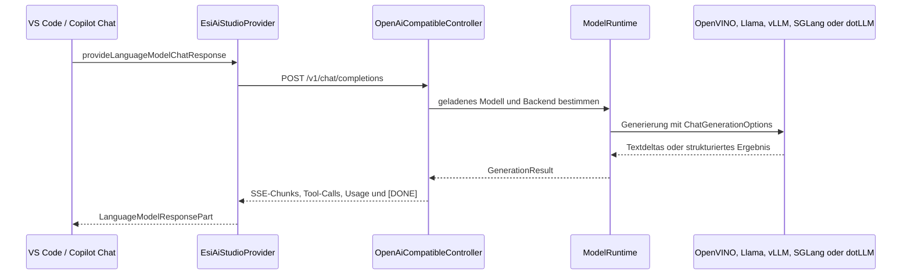

# OpenAI-kompatible WebAPI und VS-Code-Modellprovider

## Zweck und Umfang

Diese Dokumentation beschreibt die Änderungen, mit denen Esi.AI Studio als lokaler OpenAI-kompatibler Dienst für den VS-Code-Language-Model-Provider verwendet werden kann. Der Schwerpunkt liegt auf:

- Modellauflistung und Auswahl geladener Modelle
- Chat Completions als JSON- oder SSE-Antwort
- konfigurierbaren Eingabe- und Ausgabelimits von standardmäßig `32768` Tokens
- steuerbarem Reasoning beziehungsweise Thinking über `reasoning_effort`
- strukturierten Tool-Calls für Copilot-Agent-Workflows
- robustem SSE-Fehler-, Abbruch- und Keep-Alive-Verhalten
- Provider-Modellrefresh, Recovery und versioniertem Packaging

Die Implementierung besteht aus drei Schichten:

1. `OpenAiCompatibleController` stellt die HTTP-Verträge unter `/v1` bereit.
2. `Esi.AI.Models` enthält die transportneutralen OpenAI-kompatiblen DTOs und die gemeinsamen Generierungsoptionen.
3. `EsiAiStudioProvider` übersetzt zwischen der VS-Code-Language-Model-API und der WebAPI.

## Architektur und Datenfluss



Der Browser beziehungsweise Copilot kommuniziert für diese Funktion ausschließlich mit dem zentralen OpenAI-kompatiblen Controller. Die übrige Studio-Anwendungslogik bleibt von diesem Vertrag getrennt.

## WebAPI

### Endpunkte

Der Controller ist unter `v1` geroutet und stellt zwei Endpunkte bereit:

| Methode | Pfad | Zweck |
| --- | --- | --- |
| `GET` | `/v1/models` | Modelle aus dem lokalen Katalog oder von OmniRoute auflisten |
| `POST` | `/v1/chat/completions` | Eine Chat Completion erzeugen, optional als SSE-Stream |

Es gibt dafür keinen zusätzlichen Browser- oder Feature-Controller. Die API bleibt auf den OpenAI-kompatiblen Vertrag begrenzt.

### Modellauflistung

`GET /v1/models` verwendet abhängig von der Konfiguration einen von zwei Pfaden:

- Ist OmniRoute aktiviert, wird die Modellauflistung an den konfigurierten Upstream weitergereicht.
- Im lokalen Betrieb werden Modelle aus dem lokalen Katalog beziehungsweise aus `DataService.LocalModel_ReadAsync` gelesen.

Jedes Modell enthält mindestens `id`, `object`, `created` und `owned_by`. Zusätzlich werden der Anzeigename, `capabilities` und das Flag `loaded` geliefert. Modelle, die gerade geladen werden, werden nicht als aktiv geladen gemeldet. Bereits geladene Modelle werden ergänzt, auch wenn sie im lokalen Katalog nicht mehr auftauchen.

Das `loaded`-Flag ist für den Provider wichtig: Er bevorzugt geladene Modelle. Wenn kein Modell geladen ist, zeigt er die entdeckten Modelle trotzdem an, damit der Zustand sichtbar bleibt.

### Chat-Request und Contracts

Die transportneutralen Typen liegen in `Esi.AI.Models/ApiContracts.cs`. Ein Request kann unter anderem folgende Felder enthalten:

```json
{
  "model": "qwen-model",
  "messages": [
    { "role": "user", "content": "Erkläre diese Datei." }
  ],
  "max_tokens": 32768,
  "reasoning_effort": "medium",
  "stream": true,
  "stream_options": { "include_usage": true }
}
```

Unterstützte Generierungsoptionen sind:

- `max_tokens` und `max_completion_tokens`
- `temperature`, `top_p`, `top_k` und `min_p`
- `repetition_penalty`
- `seed` und `stop`
- `reasoning_effort`
- `tools`, `tool_choice` und `stream_options.include_usage`

Lokale Backends akzeptieren ausschließlich textuelle Message-Inhalte, abgesehen von Tool-Nachrichten und den für OpenVINO erhaltenen strukturierten Tool-Feldern. Nicht unterstützte Optionen wie `frequency_penalty`, `presence_penalty` oder `response_format` werden für lokale Backends abgewiesen.

### Tokenlimits

Der Provider bewirbt jedes Modell standardmäßig mit:

- `maxInputTokens = 32768`
- `maxOutputTokens = 32768`

Die Werte werden über die Einstellungen `esiAiStudio.maxInputTokens` und `esiAiStudio.maxOutputTokens` konfiguriert. Die Einstellungen werden beim Erzeugen der VS-Code-Modellinformationen verwendet. Für eine konkrete Completion sendet der Provider das Ausgabelimit als `max_tokens`.

Die Limits sind Vertrags- und Providerwerte. Die tatsächlich nutzbare Kontextgröße hängt weiterhin vom geladenen Modell und dessen Runtime-Konfiguration ab. Ein hoher Providerwert vergrößert nicht automatisch den nativen Modellkontext.

### Reasoning und Thinking

Der optionale Parameter `reasoning_effort` ist auf folgende normalisierte Werte begrenzt:

```text
none, low, medium, high, xhigh, max
```

Der Provider verwendet zuerst einen per Request gelieferten Wert aus `options.modelOptions`. Fehlt dieser, wird `esiAiStudio.reasoningEffort` verwendet; dessen Standardwert ist `none`. Der Controller validiert den Wert und überführt ihn in `ChatGenerationOptions`. Bei OpenVINO wird er anschließend an `OpenVinoGenerationOptions` weitergegeben.

Damit bleibt die Auswahl zwischen globaler Konfiguration und request-spezifischer Steuerung erhalten. Die genaue Auswirkung der Stufen ist backend- und modellabhängig; der API-Vertrag definiert die Auswahl, nicht eine für jedes Modell identische Token- oder Laufzeitsemantik.

## Streaming-Lifecycle

### Antwortablauf

Bei `stream: true` setzt `StreamCompletionAsync` die relevanten Header:

```http
Content-Type: text/event-stream
Cache-Control: no-cache, no-transform
X-Accel-Buffering: no
```

Danach folgt dieser Ablauf:

1. Ein initialer `chat.completion.chunk` mit `delta.role = "assistant"` wird sofort geschrieben.
2. Die Generierung startet unabhängig vom HTTP-Schreibpfad.
3. Textdeltas werden über einen `Channel<string>` vom Runtime-Task an den SSE-Schreibpfad übergeben.
4. Jedes nicht leere Delta wird als eigener `chat.completion.chunk` mit `delta.content` gesendet.
5. Bei OpenVINO-Tool-Calls wird das strukturierte Ergebnis nach Abschluss als finaler Delta-Chunk ausgegeben.
6. Der letzte Chunk enthält `finish_reason` und optional `usage`.
7. Der Stream endet mit `data: [DONE]` und einem abschließenden Flush.

Der Channel verhindert, dass der native Generierungsthread direkt mit dem ASP.NET-Response-Stream gekoppelt ist. `CompleteChannelAsync` überträgt Ausnahmen des Generierungstasks in den Channel, sodass sie im SSE-Pfad erkannt werden.

### Nicht gestreamte Antworten

Bei `stream: false` wartet der Controller auf `GenerateAsync` und liefert ein einzelnes `OpenAiChatCompletionResponse`-Objekt. Text, Tool-Calls, Finish-Reason und Usage liegen dann gemeinsam in der JSON-Antwort.

### Backend-Auswahl

`GenerateAsync` leitet abhängig vom geladenen Backend weiter:

| Backend | Runtime-Aufruf |
| --- | --- |
| `OpenVINO` | OpenVINO-Session mit synchronem nativen Generator |
| `vLLM`, `SGLang` | Python-Chat-Session |
| `dotLLM` | dotLLM-Chat-Session |
| `Vulkan`, `CPU` | Llama-Chat-Session |

Der angeforderte Modellname wird vor der Generierung gegen den serverseitigen Ladezustand geprüft. Sowohl der vollständige Modellpfad als auch der Dateiname können als Auswahl verwendet werden. Ein nicht geladenes Modell führt zu einer verständlichen Service-Fehlermeldung.

## SSE-Heartbeat

Während die native Generierung noch kein Delta geliefert hat, wartet der Controller zwischen den Channel-Lesevorgängen maximal 15 Sekunden. Läuft dieses Intervall ab, wird folgender SSE-Kommentar gesendet:

```text
: keep-alive

```

Eine mit `:` beginnende SSE-Zeile ist ein Transport-Kommentar. Sie ist kein OpenAI-Chat-Chunk und darf keine sichtbare Antwort oder Usage verändern. Der Provider behandelt solche Kommentare im SSE-Parser als Keep-Alive und reicht sie nicht an VS Code weiter.

Der Heartbeat schützt eine ansonsten lebende Verbindung vor Idle-Timeouts in Proxies oder Netzwerkkomponenten. Er löst jedoch keine blockierte native Modellgenerierung, keinen abgestürzten Host und keine abgebrochene Verbindung. Die serverseitige Response muss weiterhin regelmäßig flushen, damit der Kommentar den Client tatsächlich erreicht.

## Strukturierte Tool-Calls

### Request zum Modell

Der Provider übersetzt VS-Code-Tools in OpenAI-kompatible Definitionen:

```json
{
  "type": "function",
  "function": {
    "name": "read_file",
    "description": "Liest eine Datei.",
    "parameters": { "type": "object", "properties": {} }
  }
}
```

Bei einer erforderlichen Tool-Auswahl wird `tool_choice` auf `required` gesetzt; ansonsten verwendet der Provider bei vorhandenen Tools `auto`.

VS-Code-Tool-Ergebnisse werden als `role: "tool"` mit `tool_call_id` zurückgesendet. Bereits vom Modell erzeugte `LanguageModelToolCallPart`-Nachrichten werden zu `assistant`-Nachrichten mit `tool_calls` übersetzt.

### OpenVINO-Ausgabe

Wenn OpenVINO und Tools gemeinsam verwendet werden, wird die native Ausgabe strukturiert angefordert. Die Text-Streaming-Callback wird in diesem Fall nicht verwendet, weil das Ergebnis zunächst als vollständige strukturierte Ausgabe geparst werden muss. Danach werden Tool-Calls in `OpenAiToolCallDelta` umgewandelt und im finalen SSE-Chunk übertragen.

Ein Tool-Call enthält:

- stabilen `id`-Wert
- `type: "function"`
- Funktionsname
- JSON-Argumente als Text
- `index` für die Zuordnung mehrerer Calls

Der Provider sammelt Tool-Call-Deltas nach ihrem Index. Name und Argumenttext werden zusammengefügt, bevor `LanguageModelToolCallPart` an VS Code gemeldet wird. Ungültige Argumente werden als leeres Objekt behandelt, damit ein beschädigter Tool-Call nicht zu einer unkontrollierten Provider-Ausnahme führt.

### Lokale Tool-Optimierung

VS Code kann vor einer eigentlichen Agent-Anfrage eine interne Tool-Optimierungsanfrage stellen. Der Provider erkennt dieses festgelegte Promptformat lokal und erzeugt die Gruppenzusammenfassung direkt mit einem begrenzten Ergebnis von `512` Tokens. Dadurch wird dieser Verwaltungsdialog nicht unnötig an das Modell geschickt.

## Provider-Verhalten

### Modellregistrierung und Refresh

`EsiAiStudioProvider` registriert Modelle unter dem Vendor `esi-ai-studio`. Beim Laden:

1. ruft der Provider `/v1/models` auf,
2. bevorzugt Einträge mit `loaded: true`,
3. erzeugt stabile VS-Code-IDs und merkt sich die Backend-ID,
4. übernimmt Fähigkeiten wie `imageInput` und `toolCalling`,
5. meldet Änderungen über `onDidChangeLanguageModelChatInformation`.

Wenn die Modellabfrage fehlschlägt, startet der Provider einen automatischen Refresh-Versuch alle fünf Sekunden. Der Timer wird beim Dispose beendet.

### Request-Aufbau

`provideLanguageModelChatResponse` baut aus VS-Code-Nachrichten einen OpenAI-kompatiblen Request. Die Methode prüft zunächst Bild- und Tool-Fähigkeiten des ausgewählten Modells. Bilder werden, sofern unterstützt, als Data-URL in `image_url` übertragen. Tool-Definitionen werden nur gesendet, wenn das Modell Tool-Calling unterstützt.

Für jede Anfrage werden außerdem `stream: true` und `stream_options.include_usage: true` gesetzt. Die konfigurierte Request-Zeitüberschreitung wird durch einen `AbortController` überwacht; eine VS-Code-Cancellation wird als `CancellationError` weitergegeben.

### Modell-Recovery

Antwortet die API mit einem `503` und dem Hinweis, dass das Modell nicht geladen ist, aktualisiert der Provider zunächst die Modellliste. Wenn danach genau eine andere aktive Backend-ID verfügbar ist, wird die Anfrage einmal mit dieser ID wiederholt. Ist keine eindeutige Alternative vorhanden, wird der ursprüngliche Fehler beibehalten.

Diese Recovery ist bewusst begrenzt: Sie ersetzt weder das Modell-Laden in Studio noch wiederholt sie beliebige Serverfehler oder laufende Generierungen.

### SSE-Auswertung

Der Provider verarbeitet nur `data`-Events als Nutzdaten. Kommentarzeilen wie `: keep-alive` werden ignoriert. Für JSON-Daten gilt:

- `error.message` erzeugt einen verständlichen Requestfehler.
- `delta.content` wird durch den sichtbaren Textfilter geleitet und als `LanguageModelTextPart` gemeldet.
- `delta.tool_calls` wird nach Index akkumuliert.
- `usage` wird aus dem jeweils letzten Chunk übernommen.
- `[DONE]` beendet die Verarbeitung und löst die Ausgabe der finalen Text- und Tool-Parts sowie der Usage aus.

Endet der Response-Body ohne `[DONE]`, meldet der Provider ausdrücklich, dass der SSE-Stream vor dem Abschlussmarker beendet wurde. Bei einem Netzwerk- oder Fetch-Fehler wird die ursprüngliche Ursache in der Fehlermeldung weitergegeben. Eine Cancellation durch VS Code wird nicht als allgemeiner Netzwerkfehler maskiert.

### Sichtbarer Text und Thinking-Marker

Der Provider filtert `<think>...</think>`-Blöcke aus der sichtbaren Antwort. Der Filter arbeitet chunkübergreifend und hält mögliche Teilmarker zwischen zwei SSE-Datenblöcken zurück. Beim Abschluss wird der Restpuffer mit `finish()` verarbeitet.

Thinking-Text bleibt damit intern beziehungsweise unsichtbar für die normale Copilot-Antwort, während die Einstellung `reasoning_effort` weiterhin an das Modell übermittelt wird.

### Usage-Ausgabe

Wenn Usage vorhanden ist, meldet der Provider einen kurzen Zusatz mit Prompt-Tokens, Completion-Tokens und Tokens pro Sekunde. Fehlende Werte werden als `n/a` dargestellt. Das optionale Feld `total_tokens` wird vom Provider nicht für die sichtbare Zusammenfassung benötigt, bleibt aber im Vertrag verfügbar.

## Fehler- und Abbruchverhalten

Vor dem Schreiben von Response-Daten liefert der Controller normale HTTP-Fehlerobjekte mit `error.message` und `error.type`. Wenn die SSE-Header bereits gesendet wurden, ist ein Statuscodewechsel nicht mehr zuverlässig möglich. In diesem Zustand schreibt der Controller stattdessen ein JSON-Fehlerobjekt als SSE-Datenereignis und flush’t anschließend.

Wichtige Fälle:

- ungültige Nachrichten oder Samplingwerte: `400` mit `invalid_request_error`
- kein geladenes oder nicht ausgewähltes Modell: `503` mit `server_error`
- nicht erreichbarer Upstream: `503` mit `upstream_error`
- Upstream-Timeout: `504` mit `upstream_error`
- Client-Cancellation: Antwort wird beendet, ohne einen zusätzlichen Fehler zu schreiben
- Fehler nach SSE-Start: Fehlerobjekt innerhalb des laufenden SSE-Streams

Der Provider schreibt begrenzte SSE-Traces in den Output Channel und standardmäßig nach `/tmp/esi-ai-studio-provider.jsonl`. Die Traces enthalten höchstens 200 SSE-Datenblöcke; einzelne Datenwerte werden bei 4096 Zeichen gekürzt. Authorization-Werte werden in Trace-Curl-Kommandos redigiert.

## Packaging und Release

Die Provider-Version ist aktuell `0.1.24`. Jede Verhaltensänderung am Provider erfordert eine neue Patch-Version. Für einen Release müssen synchronisiert werden:

- `package.json`
- `package-lock.json`
- generiertes `dist/extension.js`
- erzeugtes VSIX-Paket

Anschließend wird das neu versionierte VSIX über `scripts/install.sh` beziehungsweise `npm run install:local` installiert. Nach der Installation muss der VS-Code-Window beziehungsweise der Extension Host neu geladen werden, bevor Modellregistrierung oder Fähigkeiten geprüft werden.

Die Studio-Anwendung selbst darf nur über die überwachte VS-Code-Debugkonfiguration beziehungsweise die Task-Kette mit aktivem Watchdog gestartet werden. Für diese reine Dokumentationsänderung war kein Studio-Neustart erforderlich.

## Validierung

Die bisherige Implementierung wurde mit folgenden Prüfungen abgesichert:

- 31 fokussierte Tests: `31 passed, 0 failed`
- direkte SSE-Anfrage ohne Tools erfolgreich
- direkte SSE-Anfrage mit strukturiertem Tool-Call erfolgreich
- Provider-Bundle gebaut und als Version `0.1.24` installiert
- `git diff --check` ohne Fehler
- Provider-Trace und Serverpfad für `[DONE]`, SSE-Fehler und Cancellation geprüft

Die Tests decken das Parsing und die strukturierten Tool-Call-Pfade ab. Ein realer, lang laufender Copilot-Agent-Request bleibt die aussagekräftigste Prüfung für die Kombination aus VS Code, Provider, HTTP-Verbindung, Modellruntime und Watchdog.

## Bekannte Grenzen und Diagnose

### Heartbeat ist kein Modellfortschritt

Ein `: keep-alive` zeigt nur, dass der HTTP-Schreibpfad noch arbeitet. Es beweist nicht, dass die native Generierung Fortschritt macht. Bei langen oder blockierten Modellaufrufen sollten deshalb parallel Studio-Logs, Prozesszustand und der Provider-Trace betrachtet werden.

### Stale Prozesse und Portbelegung

Vor einem erneuten Debug- oder Testlauf müssen alte Studio-, Watchdog- und Port-`7010`-Prozesse kontrolliert beendet werden. Ein Build darf nicht parallel zu einer aktiven Studio-Debugsession laufen.

### Fehlende Modelle

Bei `503` mit `not loaded` zuerst die Modellliste im Provider aktualisieren und in Studio prüfen, ob das gewünschte Modell vollständig geladen ist. Die automatische Provider-Recovery funktioniert nur, wenn danach genau eine eindeutige aktive Alternative gefunden wird.

### Stream endet ohne `[DONE]`

Ein Stream ohne `[DONE]` ist absichtlich ein Fehlerzustand. Zu prüfen sind:

1. der Server-Trace und die letzte `GenerationResult`- beziehungsweise Runtime-Meldung,
2. der Provider-Trace auf Heartbeats, letzte Daten und Transportfehler,
3. Cancellation oder Timeout im VS-Code-Request,
4. die tatsächliche Erreichbarkeit des Studio-Prozesses auf `127.0.0.1:7010`.

Ein Heartbeat kann einen Proxy-Idle-Timeout verhindern, aber keinen beendeten Prozess oder eine festhängende native Runtime reparieren.

