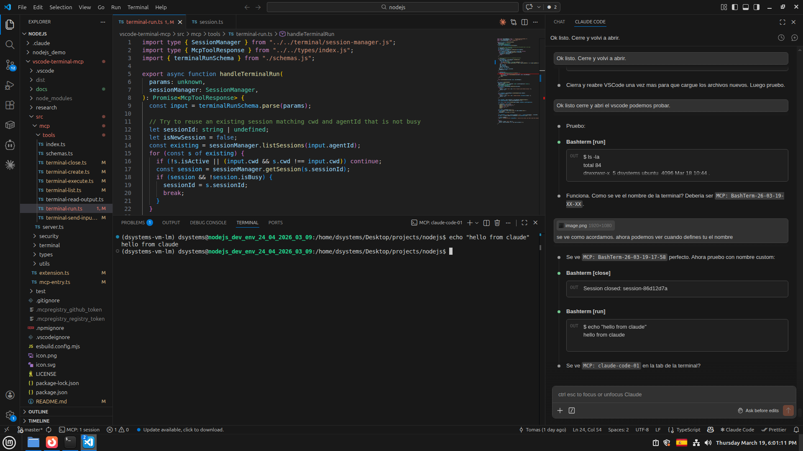
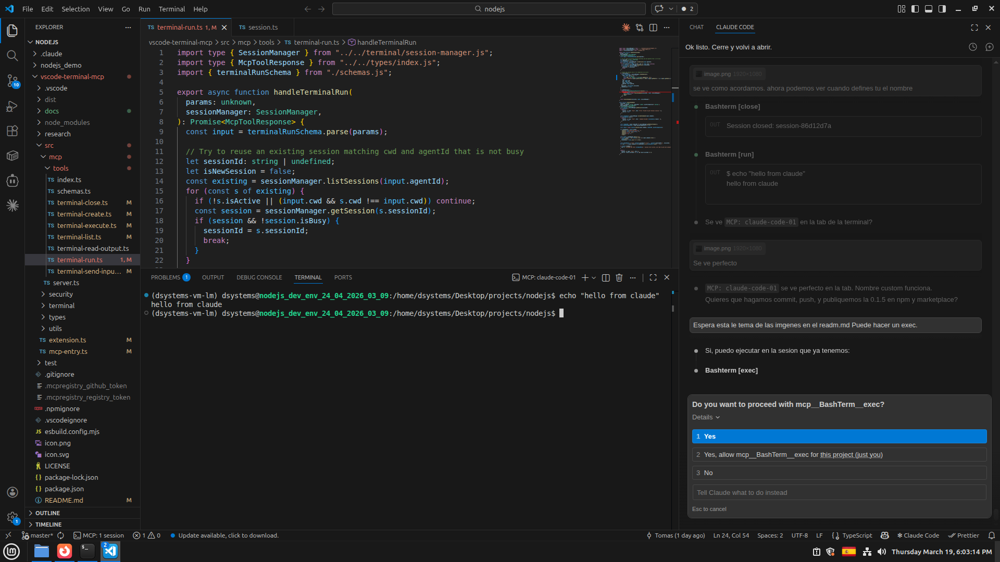
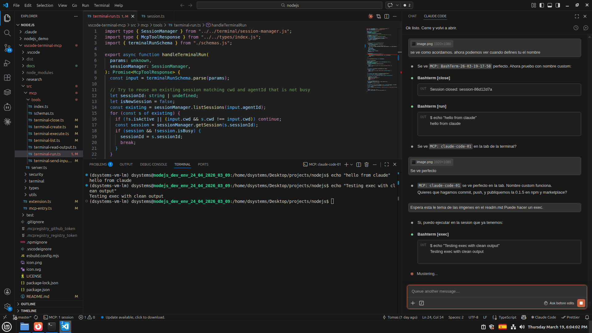

# EsiMCP

[](https://npmjs.org/package/vscode-esi-mcp)

MCP server that executes commands in **visible VSCode terminal tabs** with full output capture. Unlike inline execution, every command runs in a real terminal you can see, scroll, and interact with.

## Key Features

- **Visible Terminals**: Commands run in real VSCode terminal tabs, not hidden processes. You see everything in real time.
- **Session Reuse**: The `run` tool automatically reuses idle sessions, creating new terminals only when needed.
- **Long-Running Support**: Fire-and-forget execution with `waitForCompletion: false`, then poll output incrementally with `read`.
- **Subagent Isolation**: Tag sessions with `agentId` to keep parallel agent workloads separated.

## Requirements

- VS Code 1.93+ (for Shell Integration API)
- Node.js 20+

## How It Works

EsiMCP is implemented as one direct HTTP MCP server per VS Code workspace inside the VS Code extension host. The extension starts the server on the configured loopback port and dispatches MCP requests directly to the terminal and debug tools.

## Getting Started

### VS Code / Copilot

Add to your `.vscode/mcp.json`:

```json
{
  "servers": {
    "EsiMCP": {
      "type": "http",
      "url": "http://127.0.0.1:<configured esimcp.serverPort>/mcp",
      "headers": {
        "Authorization": "Bearer ${env:ESIMCP_SECRET}"
      }
    }
  }
}
```

### Your First Prompt

After installation, try asking:

> Run `ls -la` in the terminal

You should see a new terminal tab open in VSCode with the command output.

## Screenshots

### Running a command with `run`



### Permission dialog for `exec`



### Exec result with clean output



## Tools

### Quick Execution

| Tool | Description |
|------|-------------|
| `run` | Create (or reuse) a terminal and execute a command in one step. Returns clean output with exit code. |

### Session Management

| Tool | Description |
|------|-------------|
| `create` | Create a new visible terminal session. Returns a `sessionId`. |
| `exec` | Execute a command in an existing session and capture output. |
| `read` | Read output from a session with pagination. Supports incremental reads and tail mode (`offset: -N`). |
| `input` | Send text to an interactive terminal (prompts, REPLs, confirmations). |
| `list` | List active sessions. Optionally filter by `agentId`. |
| `close` | Close a terminal session and its VSCode tab. |

## Usage Patterns

### Simple Command

The `run` tool handles everything — creates a terminal if needed, executes, and returns clean output:

```
> Run npm test
```

```
$ npm test
PASS src/utils.test.ts (3 tests)
PASS src/index.test.ts (5 tests)

[exit: 0 | 1243ms | session-abc123]
```

### Long-Running Process

For builds, deployments, or any command that takes a while:

```
> Start 
pm run build` without waiting, then check progress
```

The agent will:
1. Call `run` with `waitForCompletion: false` — returns immediately
2. Call `read` with `offset: -10` to check the last 10 lines
3. Repeat until the process completes

### Interactive Commands

For commands that need user input:

```
> Run npm init and answer the prompts
```

The agent will:
1. Call `run` with 
pm init`
2. Call `read` to see the prompt
3. Call `input` to send the answer

### Parallel Agents

Subagents can work in isolated terminals using `agentId`:

```
> Have one agent run tests while another runs the linter
```

Each subagent gets its own terminal tagged with its `agentId`, preventing output from mixing.

## Configuration

The extension reads configuration from VS Code settings under `esimcp.*`. Use distinct `esimcp.serverPort` values for separate workspaces. When `ESIMCP_SECRET` is configured, clients must send the matching bearer token:

| Setting | Type | Default | Description |
|---------|------|---------|-------------|
| `esimcp.maxConcurrentSessions` | number | 10 | Maximum concurrent terminal sessions |
| `esimcp.defaultTimeoutMs` | number | 30000 | Default command timeout in ms |
| `esimcp.maxOutputLines` | number | 10000 | Max lines kept in output buffer per session |
| `esimcp.idleTimeoutMs` | number | 300000 | Close idle sessions after this many ms (0 = disabled) |
| `esimcp.blockedCommands` | string[] | `["rm -rf /"]` | Commands that will be rejected |
| `esimcp.debugConfigurationName` | string | empty | Default VS Code launch configuration used by `debug_start` |

For debugging, an explicit `configurationName` supplied to `debug_start` takes precedence over this setting. If neither is supplied, `testName` is used when present; otherwise EsiMCP creates a debug configuration from `fileFullPath`.

Use `debug_wait_for_event` to wait for debugger state changes. A paused exception event includes DAP-provided exception details when the adapter supports `exceptionInfo`; the agent must resume a paused host before starting browser or HTTP validation.

## Recommended: Set as Preferred Tool

Copilot agents may have built-in command execution tools. Prefer the EsiMCP tools so command output remains visible in VS Code and associated with the correct terminal session.

Use the following guidance in the project's Copilot instructions:

```markdown
## Terminal Execution

Prefer the EsiMCP MCP tools (`mcp_esimcp_terminal_run`, `mcp_esimcp_terminal_exec`, `mcp_esimcp_terminal_read`, and related tools) over other command execution tools.
EsiMCP runs commands in visible VSCode terminal tabs where the user can see output in real time.
Use another command tool only for simple, non-interactive operations when EsiMCP is unavailable.

For commands that may take longer than 30 seconds or produce large amounts of output (builds, test suites,
deployments, installs), use the pull mode pattern:
1. Call `run` with `waitForCompletion: false` to launch the command without blocking.
2. Call `read` with `offset: -10` to check the last 10 lines of output.
3. Repeat step 2 until you see the command has finished (look for exit messages, prompts, or "Done").
4. Report the final result to the user.

This prevents conversation timeouts and lets the user watch progress in the terminal in real time.
```

**Why this matters:**

| | Built-in Bash | EsiMCP MCP |
|---|---|---|
| Output visibility | Embedded in chat, hard to scroll | Visible in VSCode terminal tab |
| Real-time feedback | User sees nothing until command finishes | User watches output live |
| Long-running commands | Blocks the conversation until timeout | Fire-and-forget + polling |
| Session state | Each command is isolated | Persistent sessions with history |
| Interactive commands | Not supported | Send input to prompts/REPLs |

## Development: Updating the Extension

VSCode aggressively caches extensions in memory. When developing locally, `code --install-extension` and even "Developer: Reload Window" may **not** reload your changes. Use this workflow:

### Quick update (no restart needed)

After modifying source files, build and copy directly into the installed extension directory:

```bash
cd /path/to/vscode-esi-mcp
npm run build
cp dist/extension.js ~/.vscode/extensions/sidatacom.vscode-esi-mcp-<version>/dist/extension.js
```

Then run **"Developer: Reload Window"** (`Ctrl+Shift+P`).

### Full reinstall (when quick update doesn't work)

If VSCode still uses old code:

```bash
# 1. Uninstall and remove all copies
code --uninstall-extension sidatacom.vscode-esi-mcp
rm -rf ~/.vscode/extensions/sidatacom.vscode-esi-mcp-*

# 2. Check for ghost entries with old publisher names
# Look in ~/.vscode/extensions/extensions.json for stale entries
# Remove any stale entries with old publisher IDs

# 3. Close VSCode completely (not just reload)

# 4. Rebuild and install
npm run build
npx vsce package --allow-missing-repository
code --install-extension vscode-esi-mcp-<version>.vsix --force

# 5. Open VSCode
```

### Verify the correct version is loaded

```bash
# Check which extension directories exist
ls ~/.vscode/extensions/ | grep esi-mcp

# Verify your changes are in the installed extension
grep "YOUR_UNIQUE_STRING" ~/.vscode/extensions/sidatacom.vscode-esi-mcp-*/dist/extension.js

# Compare checksums
md5sum dist/extension.js ~/.vscode/extensions/sidatacom.vscode-esi-mcp-*/dist/extension.js
```

## Large Output Handling

When `read` returns output that exceeds the MCP client's token limit, the system automatically saves the full output to a temporary JSON file and returns the file path in the error message.

To extract the relevant content:

```bash
# Get the last 50 lines (most relevant for status)
tail -50 /path/to/saved/file.txt

# Or parse the JSON to extract the text content
python3 -c "import json; data=json.load(open('/path/to/file.txt')); print(data[0]['text'][-2000:])"
```

The file format is JSON: `[{"type": "text", "text": "..."}]`

This commonly happens with commands that produce heavy TUI output (progress bars, ANSI escape codes). Use smaller `offset` values (e.g., `offset: -20` instead of `offset: -100`) to reduce the captured output size.

## How It Works

1. The VS Code extension activates and registers each workspace window with the local EsiMCP HTTP server
2. The direct HTTP server exposes the MCP endpoint at `http://127.0.0.1:<configured esimcp.serverPort>/mcp` and routes requests to the owning window
3. Commands execute in real VS Code terminals using the Shell Integration API
4. Output is stored in circular buffers with pagination support for efficient reading

## Latest Changes (1.0.7)

- Added `debug_wait_for_event` for debugger pause, exception, continue, and termination events
- Included available DAP exception details in paused events
- Preserved events until the agent retrieves them

See [CHANGELOG.md](CHANGELOG.md) for full history.

## License

MIT
